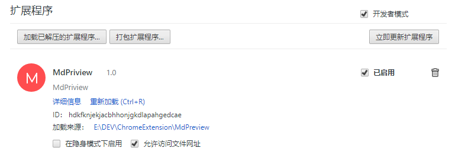

## MdPreview

此扩展程序用于在浏览器内预览 Markdown文件，例如，使用浏览器打开本地磁盘上一个名为 __readme.md__ 的文件，
此扩展程序会自动将读取的 markdown文件转化为预览模式。

注意，此扩展程序只转换本地 md文件，即以协议 __file:///__ 开头，并且以 __.md__结尾的文件，例如 __file:///C:/Users/Administrator/Desktop/README.md__

